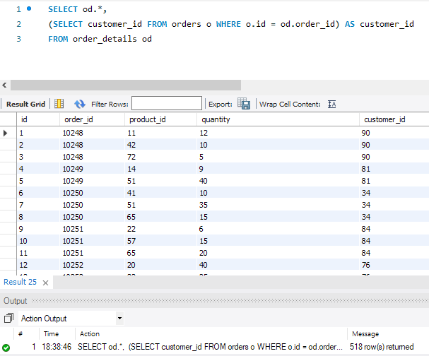
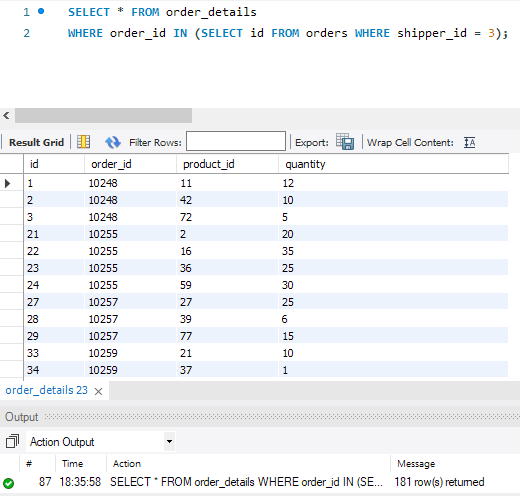
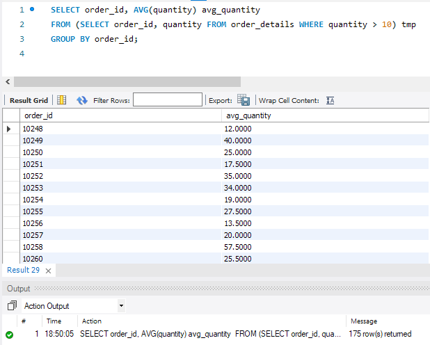
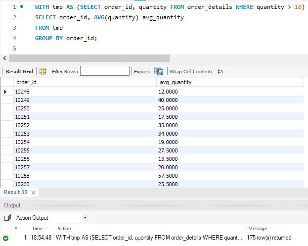
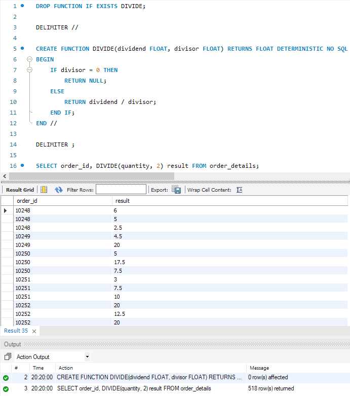

# Relational Databases DQL Subqueries, Functions, Procedures HW-05

## P1

```sql
SELECT od.*, 
(SELECT customer_id FROM orders o WHERE o.id = od.order_id) AS customer_id 
FROM order_details od
```




## P2

```sql
SELECT * FROM order_details
WHERE order_id IN (SELECT id FROM orders WHERE shipper_id = 3);
```




## P3

```sql
SELECT order_id, AVG(quantity) avg_quantity 
FROM (SELECT order_id, quantity FROM order_details WHERE quantity > 10) tmp 
GROUP BY order_id;
```




## P4

```sql
WITH tmp AS (SELECT order_id, quantity FROM order_details WHERE quantity > 10)
SELECT order_id, AVG(quantity) avg_quantity 
FROM tmp 
GROUP BY order_id;
```




## P5

```sql
DROP FUNCTION IF EXISTS DIVIDE;

DELIMITER //

CREATE FUNCTION DIVIDE(dividend FLOAT, divisor FLOAT) RETURNS FLOAT DETERMINISTIC NO SQL
BEGIN   
    IF divisor = 0 THEN
		RETURN NULL;
    ELSE
		RETURN dividend / divisor;
    END IF;
END //

DELIMITER ;

SELECT order_id, DIVIDE(quantity, 2) result FROM order_details;
```



